# Week 5 lab
> 本次 Week 5 Lab：Writing Prompts Well（寫好提示詞），要你針對同一個 Python 函式，用四種提示技巧讓 AI 產生說明文件，再依自己事先訂好的規格比較結果。
>  每人都要完成四種技巧，最後兩人合交一份文件。截止時間為 2026 年 10 月 7 日（星期三）23:59，繳交到 E3 的「Week 5 Lab」。

以下依據講義第 54–64 頁整理：[week5-prompt-engineer-1-261005.pdf](https://github.com/414551016/AI-in-the-Loop-in-Software-Project-Cycle/blob/main/Lecture/week5-prompt-engineer-1-261005.pdf)
## slide：54 -64

  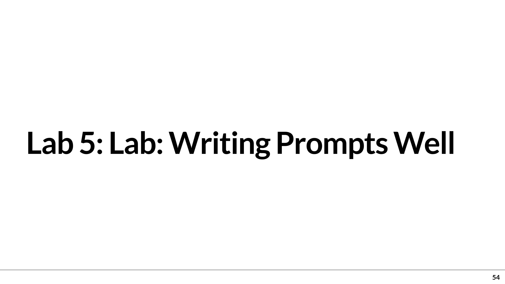
  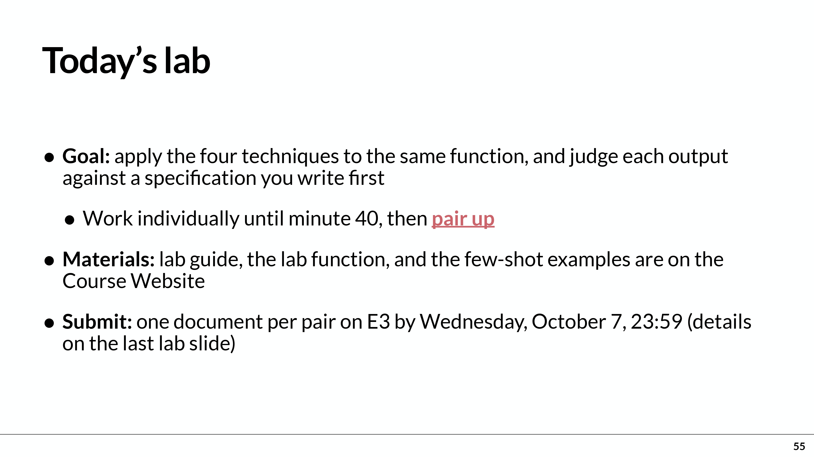
  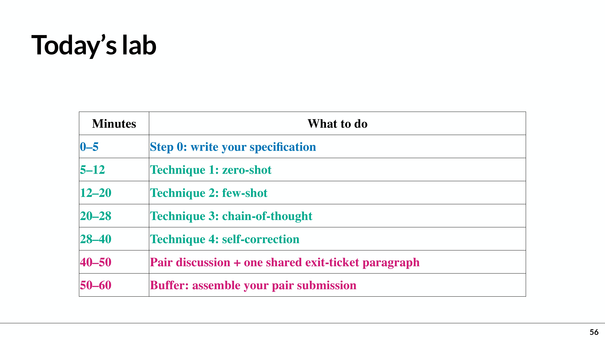
  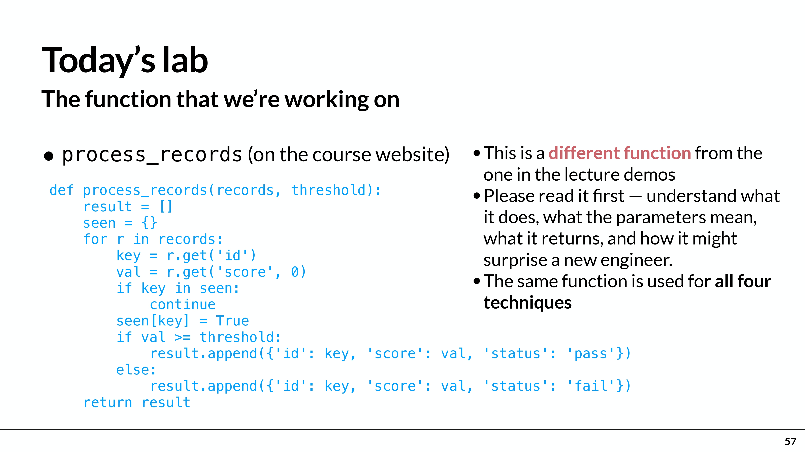
  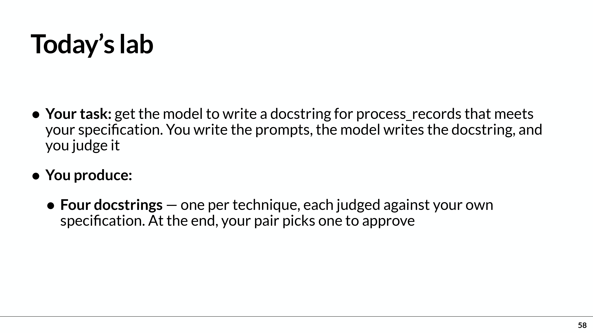
  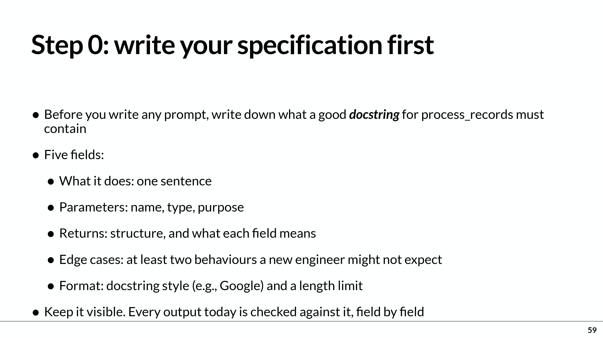
  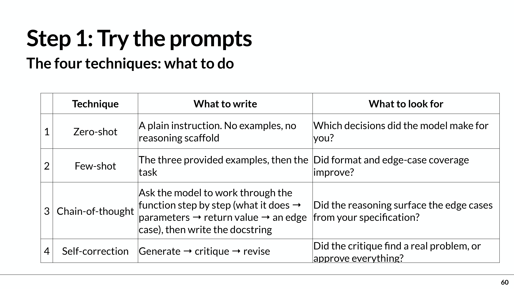
  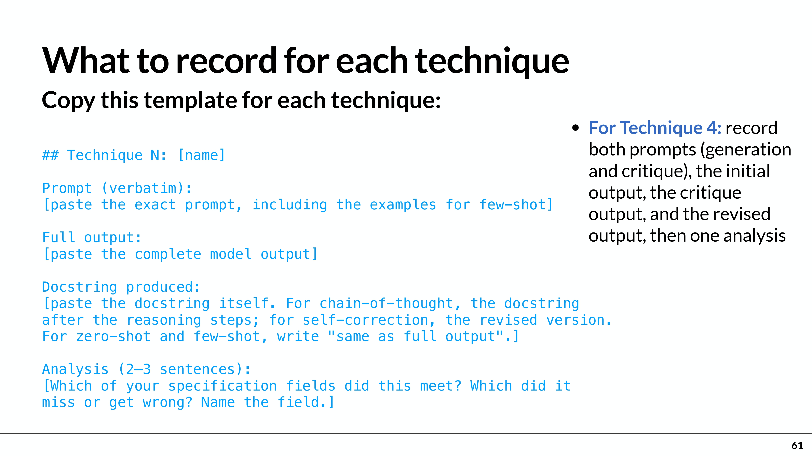
  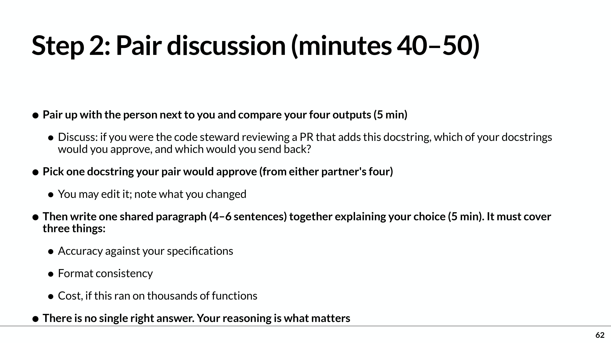
  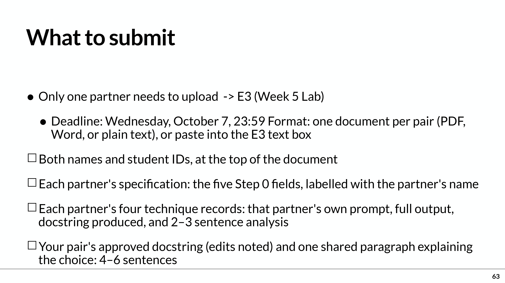
  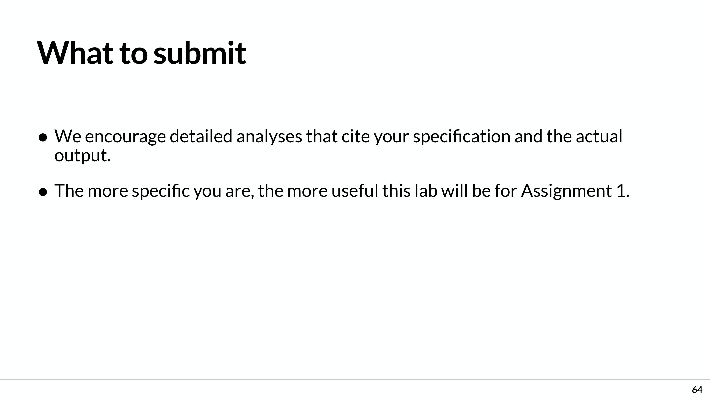

# 一、這次要處理什麼程式？
指定函式為 process_records(records, threshold)，四種技巧都使用同一個函式。依講義第 57 頁的程式，它會：
- 讀取每筆資料的 id 和 score。
- 相同 id 只保留第一筆。
- 分數 >= threshold 標記為 pass，否則標記為 fail。
- 回傳包含 id、score、status 的新列表。

本次的工作是寫提示詞，讓 AI 替這段程式寫 docstring（文件字串），再檢查是否正確。Docstring 就是放在 Python 函式內，交代功能、參數、回傳值等資訊的說明文字。

# 二、第一步：每人先寫自己的規格（Step 0）
在向 AI 輸入任何提示詞之前，先寫清楚「合格的 docstring 應包含什麼」。必須有五個欄位：
|規格欄位	|講義要求|
|--|--|
|What it does／功能	|一句話說明函式做什麼|
|Parameters／參數	|每個參數的名稱、型別、用途|
|Returns／回傳值	|回傳資料的結構，以及各欄位意思|
|Edge cases／特殊情況	|至少兩個新手工程師可能沒想到的行為|
|Format／格式	|指定 docstring 風格及長度上限|

為什麼先寫？ 因為後面四種結果都要用同一份規格逐項檢查，才能公平比較，而不是看哪份「感覺比較好」。
 可考慮的特殊情況包括：低於門檻的資料仍會保留、重複 id 不會選最高分、缺少 score 時使用 0。這些是我依程式整理的例子，規格仍應由你理解後訂定。

# 三、第二步：每人實作四種提示技巧
|技巧	|你要怎麼做	|要觀察什麼|
|--|--|--|
|Zero-shot／零樣本	|直接下指令，不提供範例或逐步分析架構	|哪些格式或內容是 AI 自己決定的？|
|Few-shot／少樣本	|放入課程提供的三個範例，再提出任務	|格式、特殊情況的說明有沒有改善？|
|Chain-of-thought／逐步分析	|請 AI 依序分析功能、參數、回傳值、特殊情況，再寫 docstring	|分析有沒有找出規格要求的特殊情況？|
|Self-correction／自我修正	|先產生 → 針對問題批評檢查 → 修改	|檢查有沒有找到真正的問題？修改是否有效？|

講義說明：Lab guide、指定函式與 few-shot 範例位於課程網站。這份 PDF 沒有列出那三個範例的完整內容，實作時需要另外取得。

# 四、每種技巧都要留下哪些紀錄？
每人四種技巧，每種都要記錄以下四項：
- Prompt (verbatim)：實際輸入的完整提示詞，逐字保留；few-shot 要包含範例。
- Full output：AI 的完整輸出，不只挑選好看的部分。
- Docstring produced：把產生的 docstring 獨立列出。
- Analysis：寫 2–3 句分析，指出符合、遺漏或寫錯了哪些規格欄位。

特別注意：
- Zero-shot、Few-shot：docstring 欄位可以寫「same as full output」。
- 逐步分析：完整輸出要保留，另列最後的 docstring。
- 自我修正：要保留生成與批評提示詞、初稿、批評內容、修改後版本，再寫一段分析。

分析應具體，例如：「這份輸出符合參數與回傳值規格，但漏掉缺少 id 時會一起被判為重複資料的行為。」這是分析寫法示例，並非已經完成的實驗結果。

# 五、第三步：兩人比較，選出共同認可的一份
兩人各自完成後，比較彼此的結果，從兩人合計八份 docstring 中選出一份，作為你們願意在程式碼審查時批准的版本。
- 可以修改選中的版本，但要註明改了什麼。
- 接著共同寫 一段 4–6 句的說明，必須涵蓋：
  - 正確性：是否符合你們的規格？
  - 格式一致性：格式是否清楚、穩定？
  - 成本：如果要對幾千個函式執行，這個方法的成本是否合理？

老師強調沒有唯一正解，重點是你們選擇的理由。

# 六、最後繳交檢查表
- 一組兩人合併成一份文件，由其中一人上傳即可：
  - [ ]文件頂端有兩人的姓名與學號。
  - 兩人各自的五欄規格，標明姓名。
  - 兩人各自的四種技巧紀錄，合計八組紀錄。
  - 每組紀錄都有完整提示詞、完整輸出、docstring、2–3 句分析。
  - 一份共同認可的 docstring；若有修改，註明修改內容。
  - 一段共同撰寫的 4–6 句選擇理由。
  - 於 10 月 7 日（三）23:59 前，繳交到 E3 → Week 5 Lab。
- 格式可用 PDF、Word、純文字，也可以直接貼到 E3 文字欄位。
   與前面 Discord 分享的差別：Daniel 的 GEPA 是額外分享的自動最佳化工具；這份 Lab 沒有要求使用 GEPA，也沒有把他使用的「15 項檢查」定為全班統一規格。本次要求是自己先訂規格、實作四種技巧、留下結果並比較。第五種 Step-back prompting 是 Assignment 1 的內容，不是本次 Lab 要做的項目。

## 教學資源：
- 這個連結是 Discord 伺服器中的頻道[tools-and-resources（工具與資源）頻道](https://discord.com/channels/1547853047458172998/1549444588987748505)

## 他分享了什麼工具？
Daniel 分享 [GEPA 的 GitHub 專案](https://github.com/gepa-ai/gepa)，並表示它能自動執行當天課堂介紹的流程：訂出規格 → AI 產生結果 → 評審評分 → 分析失敗原因 → 修改提示詞 → 再次測試，其中：
- Spec（規格）：事先寫清楚結果必須符合哪些要求。
- LLM judge（大型語言模型評審）：讓另一個 AI 判斷產出是否符合要求。
- Prompt（提示詞）：交給 AI 的工作指令。

重點是讓 AI 根據評分與失敗原因，反覆改進自己的工作指令。

