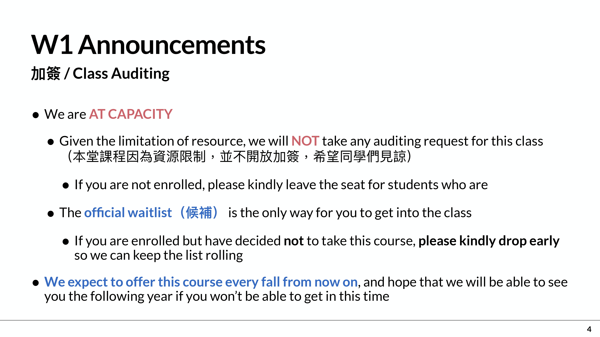
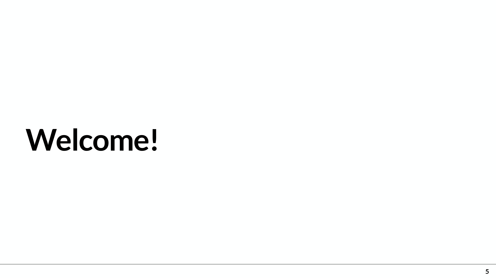
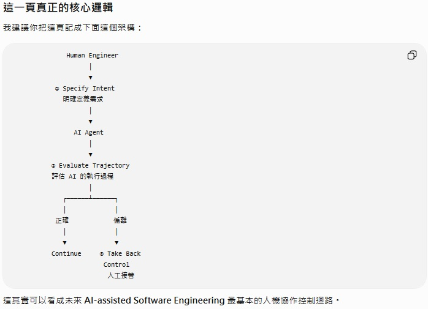
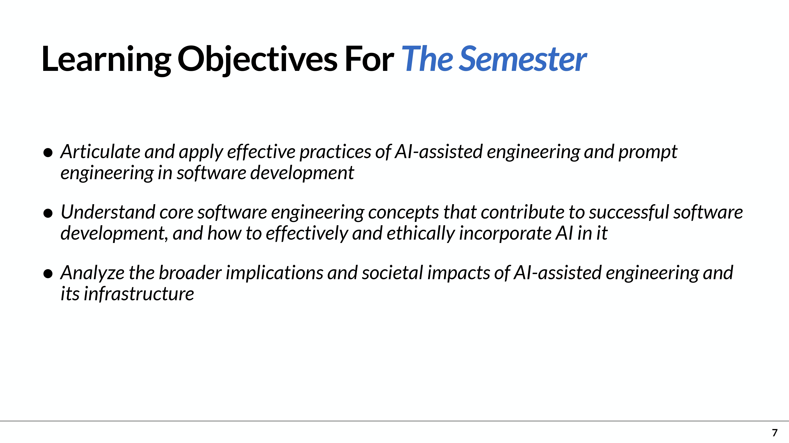

# Week01_Introduction to AI-Assisted SE

### Week 1 課堂逐字稿

  

#### [00:00:38–00:02:27]
> Hi, can everyone hear me? 嗨,大家能聽到我嗎?

  

#### [00:02:30–00:02:33]
> - as the first announcement about the wait list 作為關於等待列表的第一次宣佈
> - is that we're not taking manual add drop for this class. 也就是說,我們不 手動加降本類。

#### [00:02:33–00:02:38]

  

> - We apologize for this, 我們為此道歉,

#### [00:04:17–00:04:23]

  

> - Okay, so let's get started with the content  好吧,讓我們開始的內容

#### [00:04:47–00:05:31]

  

這張投影片是在說明本堂課的 Learning Objectives（學習目標）。核心不是單純學「怎麼寫 Prompt」，而是建立一套 在 AI Agent 時代，工程師如何與 AI 協作、監督與控制的思維。
最重要的主軸可以濃縮成三件事：說清楚要什麼 → 觀察 AI 怎麼做 → 必要時把控制權拿回來
- 1. 工程師在 Agentic Era 的三個責任：specifying intent, evaluating trajectories, and knowing when to take back control
  > - Specifying intent：明確描述意圖
  >   - 工程師必須把真正需求說清楚。
  >   - 不能只說「幫我完成」，而要交代目標、限制、輸出格式、判斷標準。
  >   - 這正是你前面 Lab 1 的 Intent–Output Gap。
  > 例如只寫：Explain this code.
  >  模型就必須自行猜測：要多詳細？給誰看？要不要講 recursion？
  >  如果改成：Explain this code to a junior engineer who has never learned recursion.
  >  你的 Intent 就比較明確。
  > - Evaluating trajectories：評估 AI 的執行軌跡
  >  這裡的 trajectory 不只是看最後答案，而是看 AI「一路怎麼做」。例如 AI Agent 要完成一個程式任務：理解需求 ↓ 分析問題 ↓ 決定修改哪些檔案 ↓ 產生程式碼 ↓ 執行測試 ↓ 修改錯誤 ↓ 輸出結果
  >  工程師不能只問：最後程式能不能跑？
  >  而要問：這就是 trajectory evaluation。
  >   - AI 做了哪些決定？
  >   - 它有沒有誤解需求？
  >   - 是否修改了不該修改的地方？
  >   - 是否用了錯誤假設？
  >   - 是否真的驗證過結果？
  > - Knowing when to take back control：知道何時要取回控制權
  >  AI Agent 可以有自主能力，但工程師仍然必須知道：哪些事情可以交給 AI，哪些事情不能讓 AI 自己決定。
  >  例如：AI 可以自行：
  >   - 整理程式碼
  >   - 產生測試
  >   - 查找 bug
  >   - 草擬文件
  > 但若涉及：工程師就應該重新介入。
  >   - 刪除重要資料
  >   - 修改 production system
  >   - 安全權限
  >   - 資料庫 migration
  >   - 關鍵架構決策
  >   - 不可逆操作
  > 因此 Agentic AI 的核心不是：「AI 越自主越好」。而是：適當授權 + 持續監督 + 必要時人工接管。
- 2. Understand the course structure, components, expectations, and resources
  > 第二個學習目標是：了解整門課的架構、課程組成、要求以及可用資源。
  >  也就是學生需要知道：
  >   - Lab 要做什麼
  >   - Assignment 要做什麼
  >   - Project 如何進行
  >   - 作業如何評分
  >   - GitHub / AI tools 如何使用
  >   - 課程提供哪些資源
  >  這點看起來只是行政資訊，但其實老師希望你開始建立：Course workflow / project workflow 而不是每週只完成單一作業。
- 3. Identify a decision the model made without being asked
  > 第三點非常重要：找出至少一個「你沒有要求，但模型自己做出的決定」。這正是本課程一直強調的概念。
  >  例如你問：Explain this Python function.
  >  AI 可能自行決定：
  >   - 使用專業術語
  >   - 假設你知道 Python
  >   - 假設你知道 recursion
  >   - 用條列式回答
  >   - 說它是 Quicksort
  >   - 不解釋 time complexity
  > 這些都是：Implicit decisions（隱含決策）老師要求你不只發現它，還要進一步問：如果是我，我會做相同決定嗎？
  >  例如：
  >  AI 的決定：假設讀者已經了解 recursion
  >  我的評估：我不會做相同選擇，為我的真正目標讀者是初學者。這其實就是 Human Oversight（人工監督） 的雛形。
- 4. Write your first Prompt Engineering Log
  > 第四點：根據今天的 Lab，完成第一份 Prompt Engineering Log。也就是你前面已經做的 Week 1 Lab。
  >  它不是單純把 Prompt 抄下來，而是紀錄：我原本的 Intent ↓ 我寫出的 Prompt ↓ AI 怎麼理解 ↓ AI 做了哪些自行決定 ↓ Output 是否符合需求 ↓ 我修改什麼 ↓ 結果是否改善
  >  因此 Prompt Engineering Log 其實是一種：工程實驗紀錄，而不是「聊天紀錄」。

**這一頁真正的核心邏輯***
 我建議你把這頁記成下面這個架構：

  

> - So the learning objective for today is  所以今天的學習目標是
> - I want everybody to be able to describe  我希望每個人都能描述
> - what we're going to learn for this semester,  這學期我們要學什麼
> - the three responsibilities in the agentic area,  代理領域的三項責任,
> - era of coding, specifying the intent,  規定意圖,
> - evaluating trajectories  評估軌跡
> - and knowing when to take back control from the AI.  並且知道何時從AI手中奪回控制權.
> - And I also hope that you could understand  我也希望你能夠明白
> - the core structure, the components, expectations and the resources.  核心結構、組成部分、期望以及資源。
> - So I also want you to identify at least one decision  所以我還要你至少確定一個決定
> - that model made without being asked during the demo and evaluate whether you would have made the same choice.  演示時未詢問的模型並評估你是否會做出同樣的選擇。
> - And finally, you would be writing your first prompt in this classroom and log it based on today's lab.  最後,你會寫你的第一個提示記錄在今天的實驗室上

#### [00:05:32–00:05:36]

  

> - So let's take the whole picture of the whole course.  因此,讓我們把整個航道的全貌照一照.
> - The semester, we want you to be able to articulate and apply effective practices of AI-assisted engineering and prompt engineering in software development.  學期,我們要你講清楚，應用AI輔助工程的有效做法，並迅速進行軟體開發工程。

  

  

  

