Prompt：請說明本教學重點內容，及你的看法與總結
### Week 3 課堂逐字稿
## slide：1 -2

  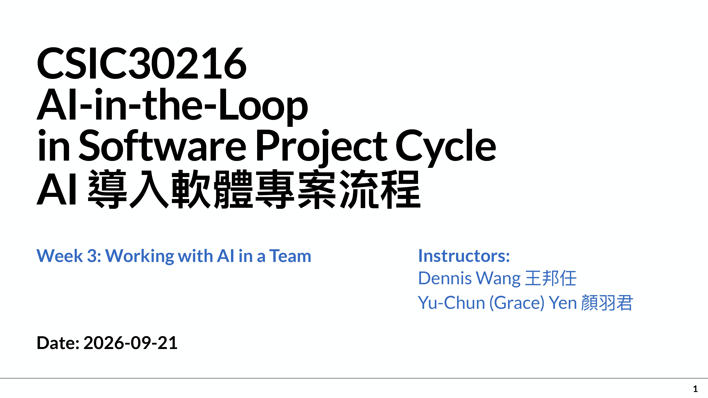
  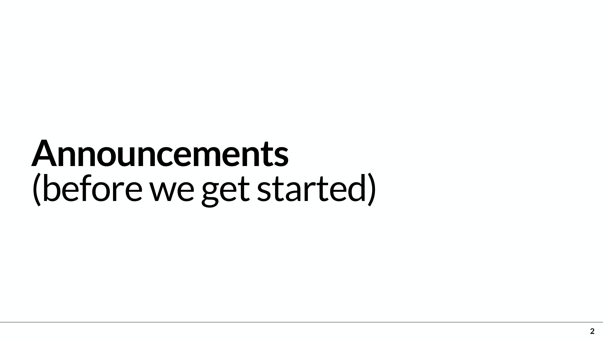

## slide：3 W3 Announcements（第 3 週的課程行政公告）

  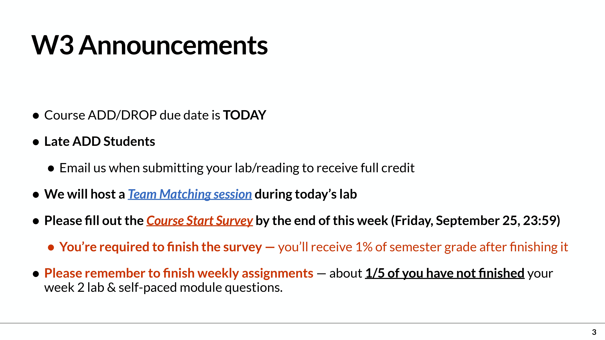

此頁簡報（W3 Announcements）為第 3 週的課程行政公告：
- 教學重點內容
  - 選課與加退選截止日：今日（TODAY）為課程加退選（ADD/DROP）的最後截止期限。
  - 晚加選（Late ADD）學生注意：晚加選的同學在繳交 Lab 作業或閱讀報告時，請發送信件給授課團隊以確保能取得 Full Credit。
  - 團隊配對（Team Matching）：今天實作課（Lab）期間將舉辦團隊配對活動。
  - 期初問卷（Course Start Survey）：請於本週五（9/25 23:59）前填寫完畢，完成問卷可獲得學期總成績 1% 的分數。
  - 每週作業提醒：提醒學生記得完成每週作業，目前約有 1/5 的同學 尚未完成第 2 週的 Lab 與自拍拍程式模組問題。
- 看法與總結： 這頁公告凸顯了第 3 週是課程邁入正軌的關鍵時間點。對於學生來說，除了要把握最後退選與補交作業的期限外，最重要的任務是參與今天的團隊配對與完成填寫能拿到 1% 總成績的期初問卷。高達 20% 的學生尚未完成第 2 週作業，顯示部分同學可能還在適應課程節奏，建議儘快補齊進度以避免影響後續的專案合作與成績表現。

## slide：4 Learning Objectives（核心學習目標）

  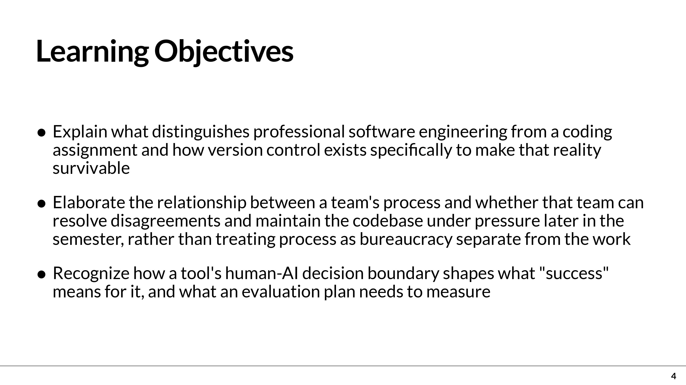

此頁簡報再次聚焦於本課程的 核心學習目標（Learning Objectives）：
- 教學內容摘要
  - 專業軟體工程與版本控制：釐清專業軟體工程與單純寫程式作業的本質差異，並說明版本控制（如 Git/GitHub）為何是團隊在複雜開發環境中生存的關鍵。
  - 團隊流程與抗壓維護：強調團隊協作規範與溝通流程並非繁瑣的官僚形式，而是當專案面臨時程壓力、團隊產生分歧時，能夠順利解決爭議並持續維護程式碼庫（Codebase）的核心基礎。
  - 人機決策界線與評估計畫：引導學生識別工具中「人類與 AI 的決策界線（Human-AI Decision Boundary）」，進一步定義專案的「成功」，並據此規劃評估計畫（Evaluation Plan）所應衡量的指標。
- 看法與總結
  - 這頁簡報點出了從「個人寫程式」跨越到「團隊與 AI 協同開發」的思維轉變。在 AI 能夠大量自動產生程式碼的時代，軟體開發的瓶頸已不在於語法撰寫，而在於架構治理、人機分工與團隊溝通。
  - 特別是結合本週的實作任務（Week 3 Lab）來看，課程並非空談理論，而是透過建立分支保護、制定 AI 使用規範與評估計畫，讓團隊在開發初期就劃清決策權責。這不僅能防止盲目接受 AI 產出的「Vibe Coding」亂象，更是確保專案在長期高壓維護下不致崩潰的實務關鍵。

## slide：5

  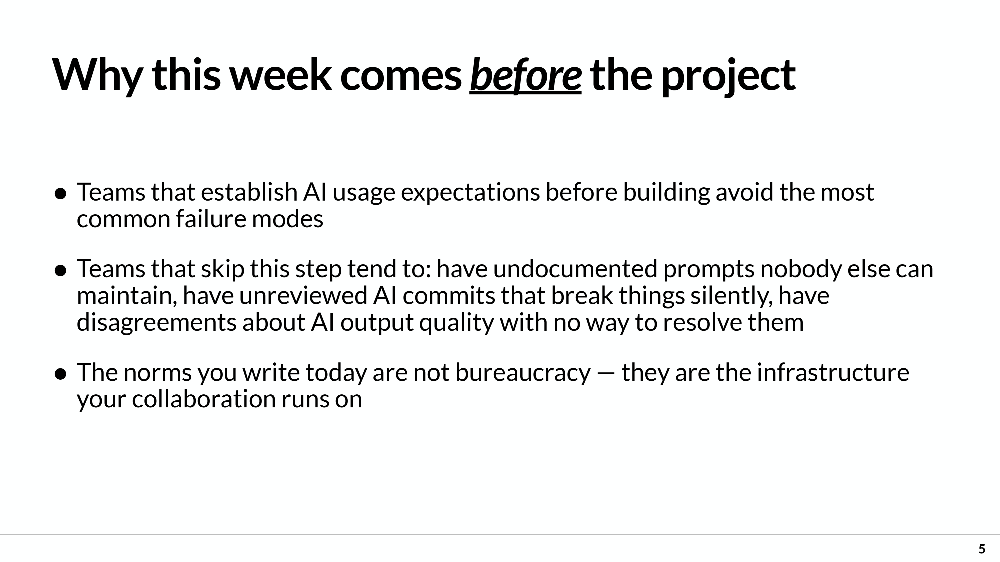

此頁簡報（Why this week comes before the project）強調了在正式啟動專案前，先建立團隊 AI 規範與基建的重要性：   
- 教學重點內容：
  - 避免最常見的失敗模式：在專案開發前就建立 AI 使用期望與規範的團隊，能有效避開多數專案常見的失敗陷阱。
  - 跳過此步驟的後果：未建立規範的團隊往往會遇到提示詞未記錄而無法維護、未經審核的 AI 提交（Commits）暗中破壞程式，以及對 AI 產出品質產生爭議卻無法解決等問題。
  - 規範即基礎設施：今天所訂定的團隊規範（Team Norms）絕非繁瑣的官僚形式，而是支撐團隊協作流暢運作的基礎設施（Infrastructure）。
- 看法與總結
  - 這張簡報深刻點出了「個人 AI 寫程式」與「團隊 AI 協同開發」的最大差異。當 AI 介入開發流程時，若沒有事先劃清工具使用邊界、PR 審核機制與爭議裁決標準，AI 的高產出反而會演變成團隊溝通與維護的災難。
  - 結合本週的 Lab 實作內容（設定 GitHub 分支保護、撰寫 PR 樣板與指定 Code Steward）來看，課程正是要引導學生在動手寫 Code 之前，先把團隊的「遊戲規則」與「AI 決策邊界」架構好。這是確保專案在後續開發中不致陷入混沌、實現可持續維護的最關鍵第一步。

## slide：6

  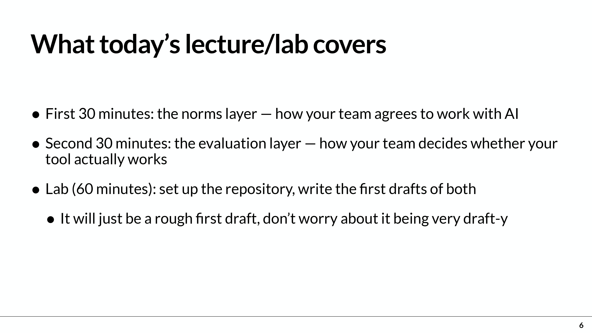

## slide：7

  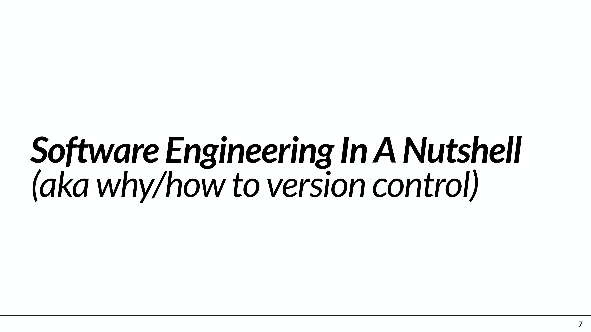

## slide：8

  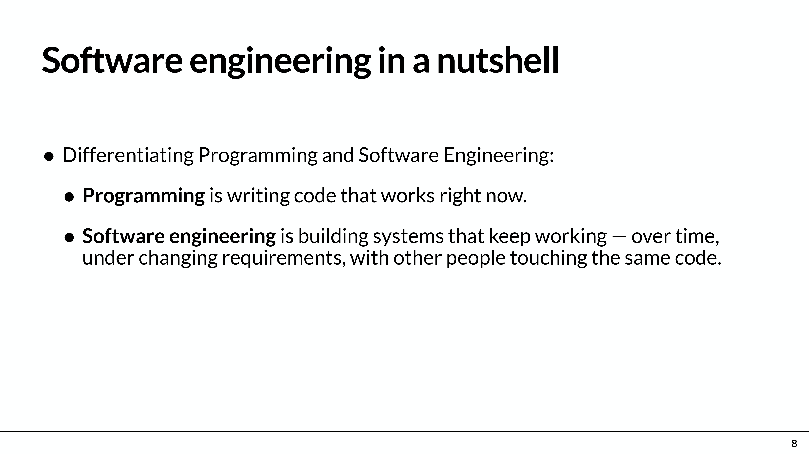

## slide：9

  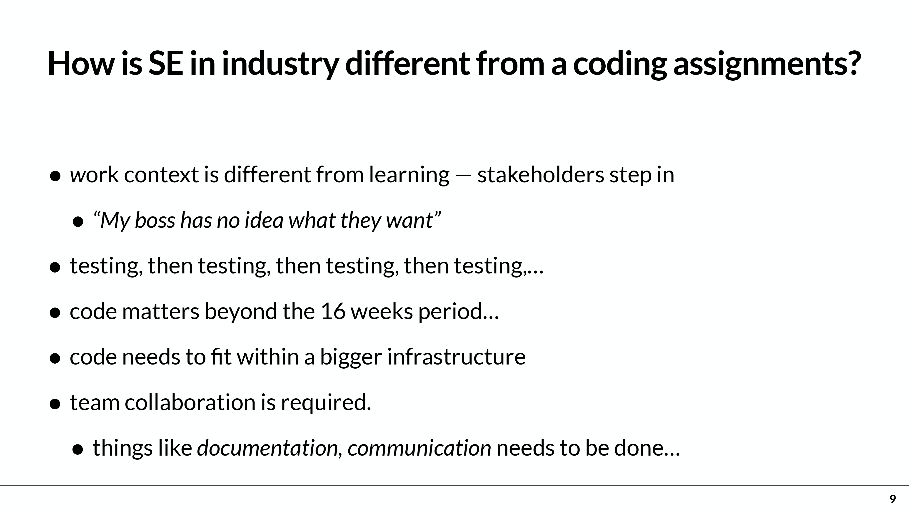

## slide：10

  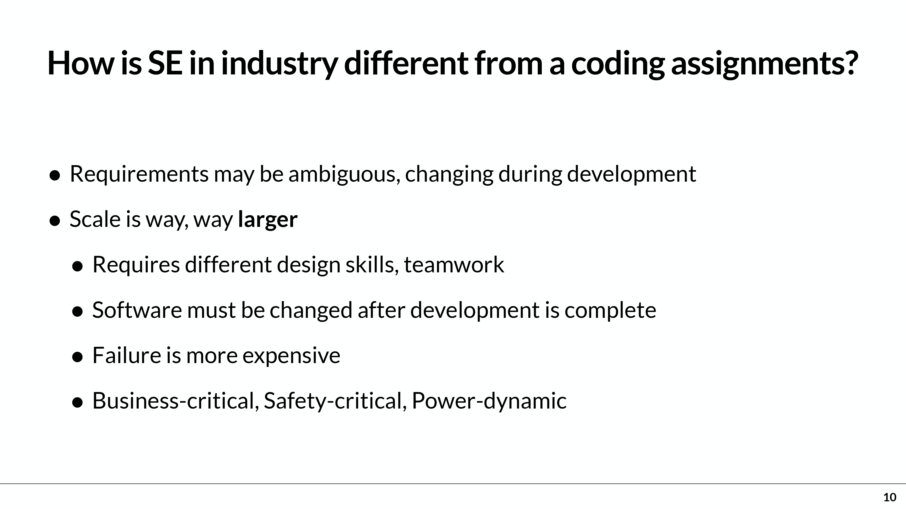

## slide：11

  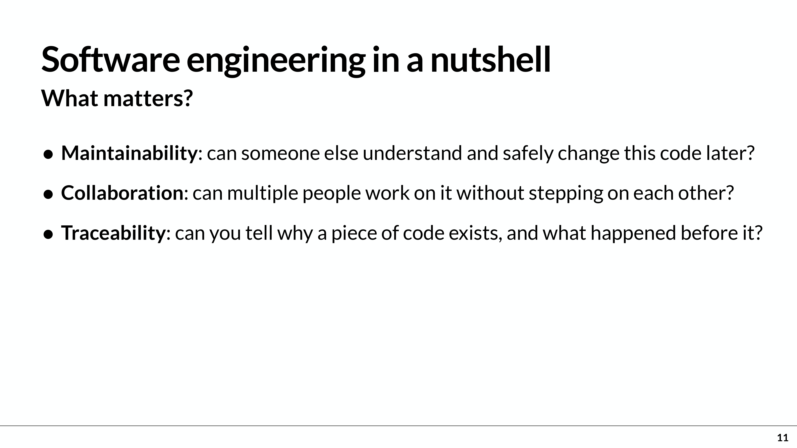

## slide：12

  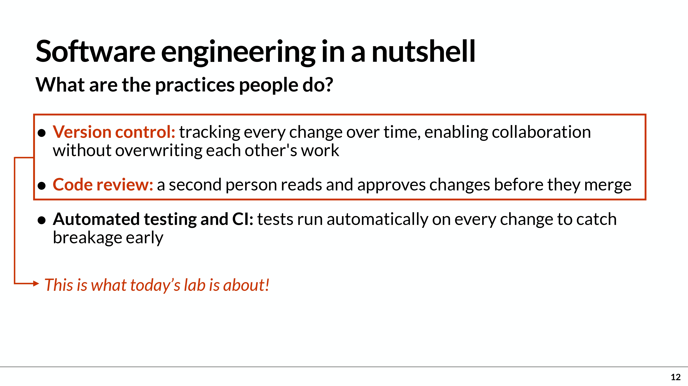

## slide：13

  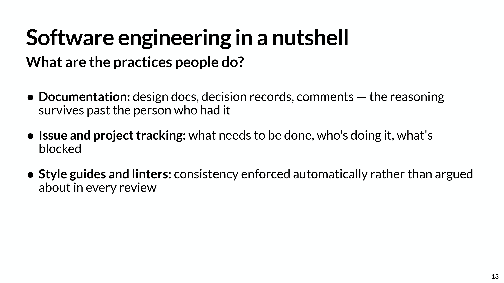

## slide：14

  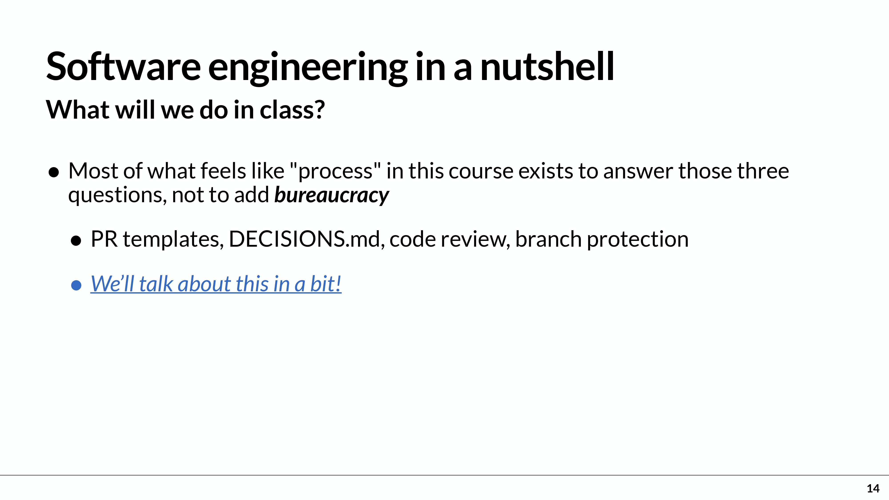

## slide：15

  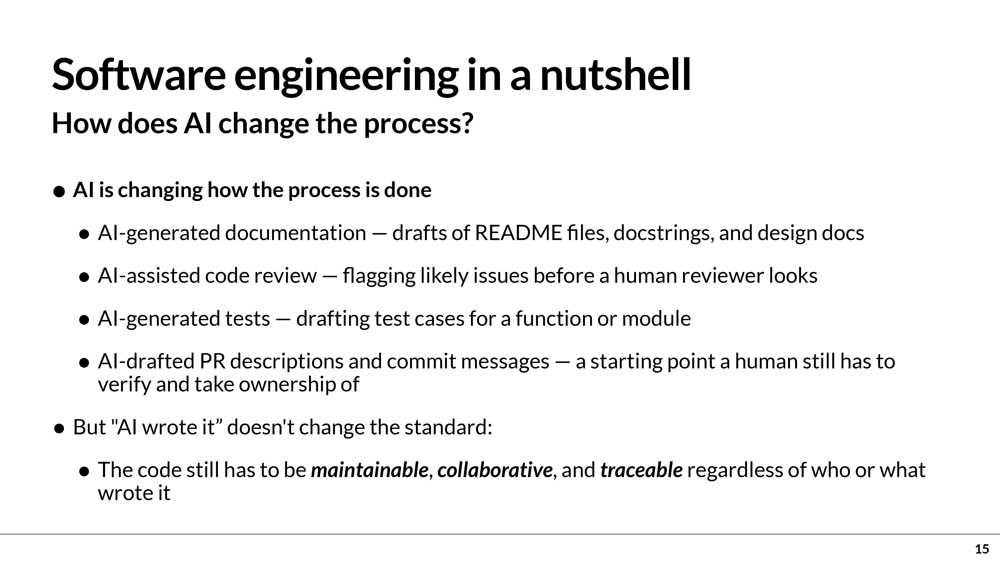

## slide：16

  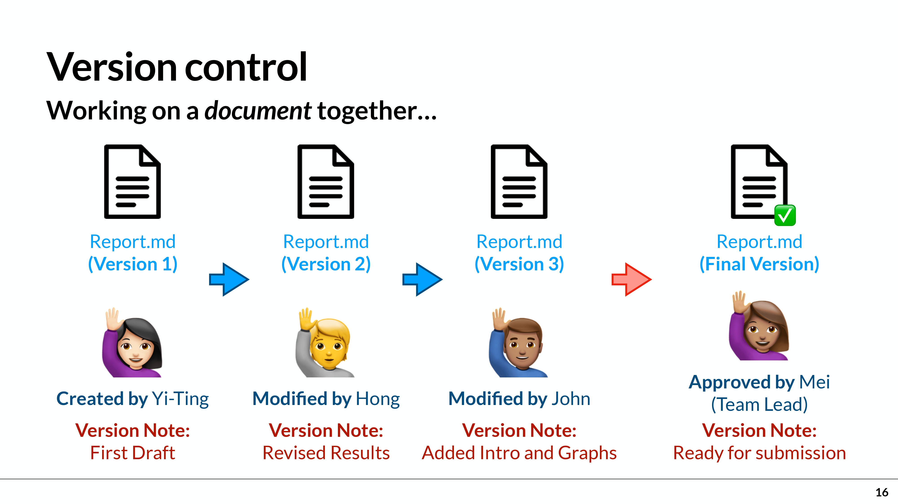

## slide：17

  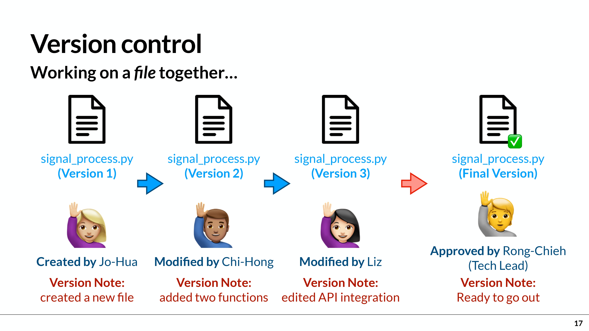

## slide：18

  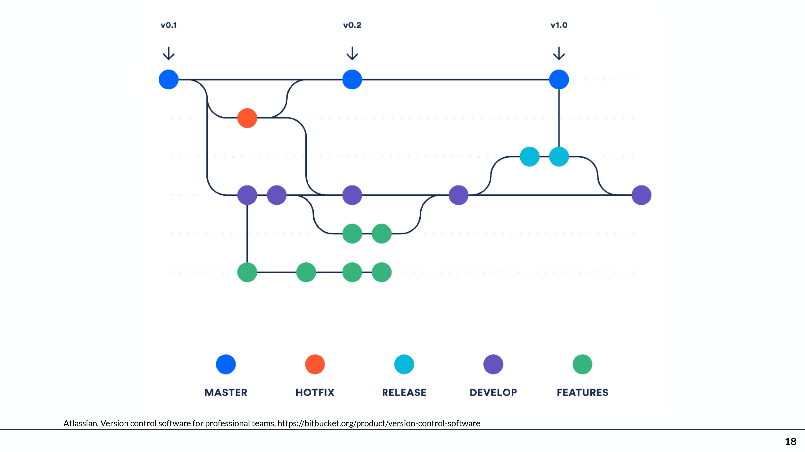

## slide：19

  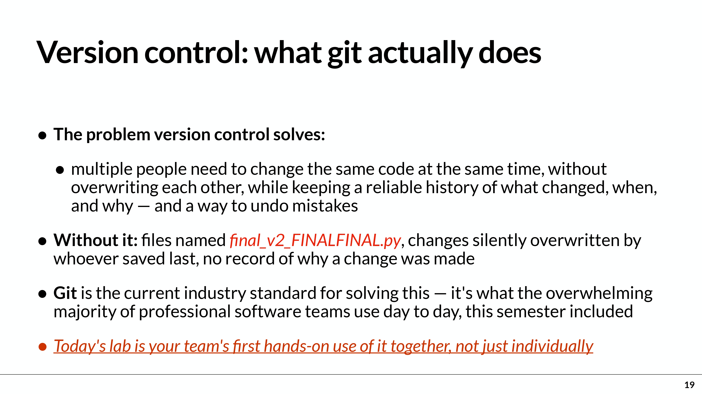

## slide：20

  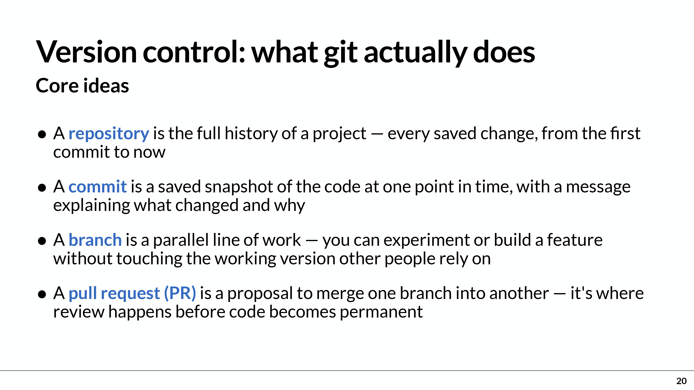

## slide：21

  

## slide：22

  

## slide：23

  

## slide：24

  

## slide：25

  

## slide：26

  

## slide：27

  

## slide：28

  

## slide：29

  

## slide：30

  

## slide：31

  

## slide：32

  

## slide：33

  

## slide：34

  

## slide：35

  

## slide：36

  

## slide：37

  

## slide：38

  

## slide：39

  

## slide：40

  

## slide：41

  

## slide：42

  

## slide：43

  

## slide：44

  

## slide：45

  

## slide：46

  

## slide：47

  

## slide：48

  

## slide：49

  

## slide：50

  

## slide：51

  

## slide：52

  

## slide：53

  

## slide：54

  

## slide：55

  

## slide：56

  

## slide：57

  

## slide：58

  

## slide：59

  

## slide：60

  

## slide：61

  

